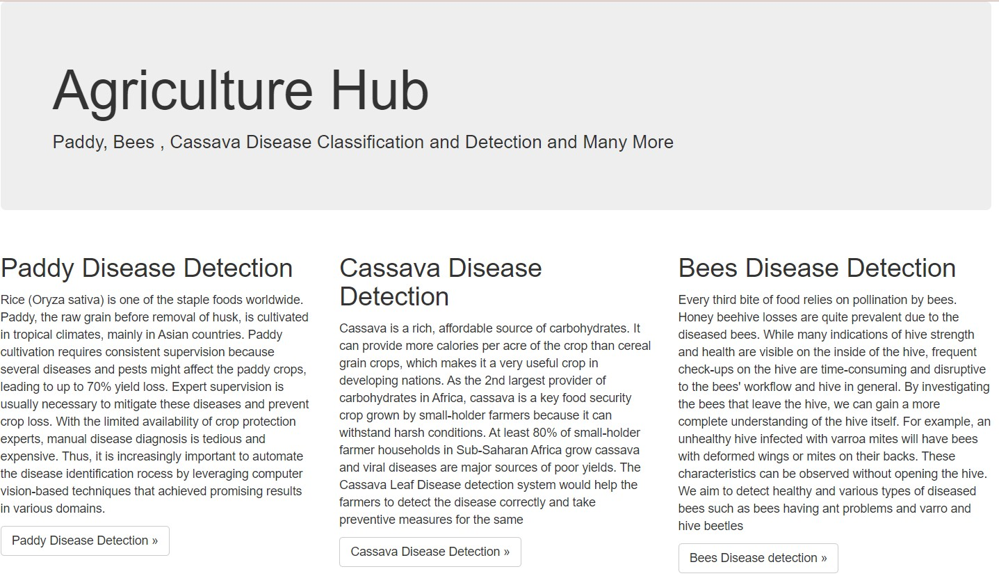

# Agriculture Hub                

The vision of **Agriculture Hub**  is to be a 1 stop destination for farmers across India to help them to cultivate better crops , fruits and also to better of their lives.    

In the present solution we have presented **4** components 

1. Static website which links the following 3 components   
2. **Paddy Disease Detection** -  For detecting Paddy Diseases   
3. **Cassava Disease Detection** -  For detecting Cassava Diseases   
4. **Bees Disease Detection** -  For detecting Bees Diseases       

# Architecture of the Disease Classification systems       

The solution would be implemented as web application which is also mobile enabled. The farmers can
access this application anywhere and can upload the images to detect the disease in the cassava leaves.     
1. `Flask` is used as UI            
2. The application is deployed as a `Container App`        
3. `Azure Custom Vision API` used to detect the  diseases      
4. `Azure Container Registry` used to store the container images    
5. The secrets required for the solution are stored in `Azure Key Vault`
6. The `Azure Container App` uses `Managed Identity`       
7. The integration of Azure Container App with `GitHub Actions` is used for `CD[Continuous
Deployment]`       
8. The images are stored in the `Azure Blob Storage `      
9. The predictions obtained from the `Azure Custom Vision API` are stored in `Cosmos DB`.   

**Paddy Disease Detection**

**Rice (Oryza sativa)** is one of the staple foods worldwide.    

Paddy, the raw grain before removal of husk, is cultivated in tropical climates, mainly in Asian countries. Paddy cultivation requires consistent supervision because several diseases and pests might affect the paddy crops, leading to up to 70% yield loss. Expert supervision is usually necessary to mitigate these diseases and prevent crop loss. With the limited availability of crop protection experts, manual disease diagnosis is tedious and expensive. Thus, it is increasingly **important to automate the disease identification process by leveraging computer vision-based techniques** that achieved promising results in various domains.              

**Cassava Disease Detection**

**Cassava** is a rich, affordable source of carbohydrates. It can provide more calories per acre of the
crop than cereal grain crops, which makes it a very useful crop in developing nations.             

As the `2nd largest provider of carbohydrates in Africa`, cassava is a key food security crop grown
by small-holder farmers because it can withstand harsh conditions. At least 80% of small-holder
farmer households in Sub-Saharan Africa grow cassava and viral diseases are major sources of poor
yields.             
We have taken 105 images for 5 categories,4 leaf disease categories   
`[cbb,cbsd,cgm,cmd]` and a
`healthy` category. The Cassava Leaf Disease detection system would help the farmers to detect the
disease correctly and take preventive measures for the same.       

**Bees Disease Detection**

        

**Every third bite of food** relies on pollination by bees. Honey beehive losses are quite prevalent due to the diseased bees.         

While many indications of hive strength and health are visible on the inside of the hive, frequent check-ups on the hive are time-consuming and disruptive to the bees' workflow and hive in general. By investigating the bees that leave the hive, we can gain a more complete understanding of the hive itself. For example, an unhealthy hive infected with varroa mites will have bees with deformed wings or mites on their backs. These characteristics can be observed without opening the hive.

We aim to detect **healthy and various types of diseased bees such as bees having ant problems and varro and hive beetles** with the help of Azure Custom Computer Vision Services.

